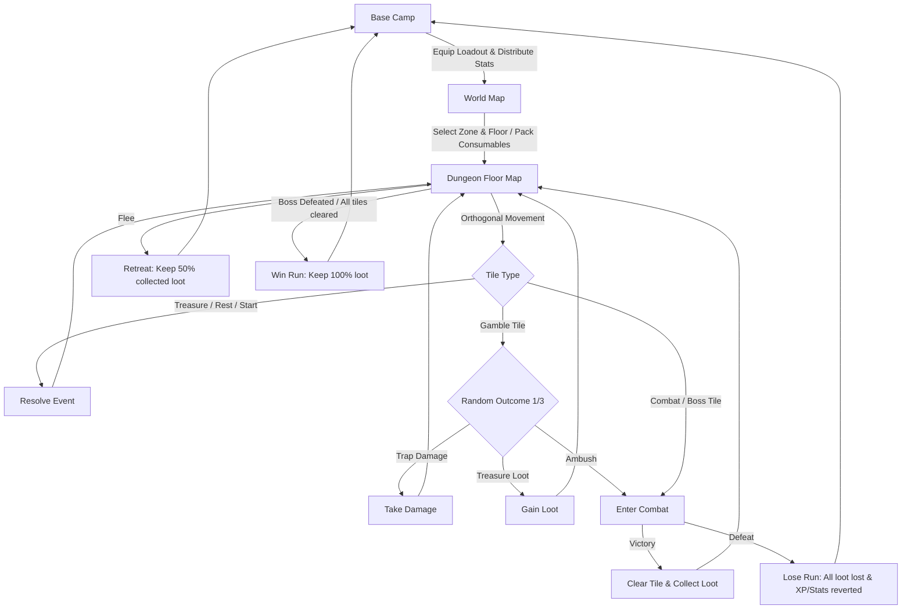
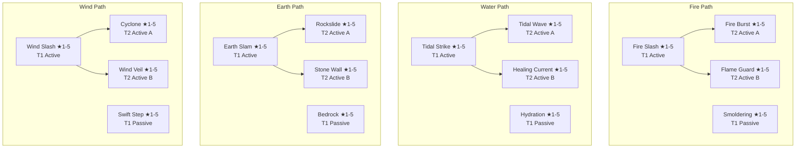

# Meow Depths — Complete Game Details & Mechanics Specification

Welcome to the definitive guide and specification for **Meow Depths**, a cozy yet grim grid-based mobile RPG built with React Native and Expo. In this game, players guide **Mochi**, a brave feline protagonist and new recruit of the ancient **Meow Order**, through dark dungeons across three distinct zones to fight enemies, forge legendary gear, and grow in power.

---

## 🗺️ High-Level Game Flow

The game operates on a persistent loop between the safe haven of **Base Camp** and the perilous **Dungeon Floors**.



---

## 🛠️ Tech Stack & Architecture Overview

- **Core Framework**: Expo + React Native.
- **State Management**: React Context (`GameContext`) with a single global reducer (`gameState.js`). 
- **Persistence**: Auto-saves to `AsyncStorage` on every state change.
- **Forward Compatibility**: Uses a custom `deepMerge` utility when loading saves. If new fields are added to `initialState` in updates, they are merged seamlessly with existing player save data.
- **Combat Isolation**: To avoid React's state batching lag during turn animations, the **`CombatScreen` reads global state once on mount**, handles the entire battle in isolated local React state, and writes the results back to the global reducer only when the fight terminates.

---

## 🐱 Progression & RPG Systems

Mochi grows stronger by earning Experience Points (XP) in dungeons, leveling up, and allocating stat points.

### Leveling & XP Curve
- **Level 1** is free.
- **Level 2** requires **100 XP**.
- **Level 3** requires **250 XP**.
- **Level 4+** scales on a **35% compounded exponential curve**:
  $$\text{XP Required}(N) = 250 + \sum_{l=4}^{N} 150 \times 1.35^{l-3}$$
  *(Rounded to the nearest 10 XP)*

On each level-up, Mochi fully heals and receives:
- **+3 Stat Points** (to allocate manually).
- **+1 Skill Point** (to unlock or star-up talents).

### Core Attributes
Players manually distribute Stat Points across three main attributes:

| Attribute | Base Value | Stat Point Benefit | Impacted Secondary Stats |
| :--- | :---: | :--- | :--- |
| **💪 Strength (STR)** | 10 | +1 Attack power | Increases base Attack |
| **🏃 Agility (AGI)** | 10 | +0.5% Crit & Dodge | Increases base Crit & Dodge chances |
| **💚 Vitality (VIT)** | 10 | +5 Max HP | Increases base Max HP |

> [!NOTE]
> Base Defence is always **0**. Defence can only be gained through equipped gear or active skill buffs.

---

## 🔮 Elemental Stance & Skill System

Mochi chooses an **Elemental Path** (Fire, Water, Earth, or Wind) upon starting the game. This choice is permanent until the save file is reset. Active skills require cooldown management in combat, while passives are active as long as they are equipped (Mochi has **2 active skill slots**).

### Stances (Innate & Passive)
Elemental stances are always active and scale with Mochi's level:
- 🔥 **Fire (Smoldering Aura)**: Grants **+1% ATK per level** and boosts Burn damage ticks by **+1 damage per 5 levels**.
- 💧 **Water (Water Stance)**: Grants **+1% Max HP per level**.
- 🪨 **Earth**: *Coming Soon* (No active bonuses).
- 🌪️ **Wind**: *Coming Soon* (No active bonuses).

---

### Skill Trees by Element



#### 🔓 Skill Unlock & Star-Up Prerequisites
- **Tier 1 (T1) Skills**: Cost **1 SP**. Requires Mochi to be at least **Level 2**.
- **Tier 2 (T2) Skills**: Cost **2 SP**. Requires Mochi to be at least **Level 10** and the parent T1 active skill to be fully upgraded to **★5**.
- **Star-Ups (★2 to ★5)**: Cost **1 SP** for Tier 1, **2 SP** for Tier 2.

---

### Skill Data Sheets

#### 🔥 Fire Skills
*Focused on patient pressure, high damage, and ticking Burn damage over time.*

1. **Fire Slash** (T1 Active - Cooldown: 3t)
   - *Description*: Deals fire damage and applies a guaranteed Burn stack.
   - *★1*: 1.20x DMG multiplier, 2 Burn DMG/turn, 1 turn duration.
   - *★5*: 2.00x DMG multiplier, 4 Burn DMG/turn, 3 turns duration.
2. **Smoldering** (T1 Passive)
   - *Description*: Increases all ticking Burn damage.
   - *★1*: +1 Burn DMG/tick.
   - *★5*: +5 Burn DMG/tick.
3. **Fire Burst** (T2 Active - Cooldown: 4t)
   - *Description*: AOE explosion. Deals full damage to primary target + applies Burn; splashes adjacent targets for 50% damage with a chance to apply Burn.
   - *★1*: 1.50x DMG multiplier, 4 Burn DMG, 3t duration, 30% splash damage, 30% splash Burn chance.
   - *★5*: 2.00x DMG multiplier, 6 Burn DMG, 3t duration, 50% splash damage, 50% splash Burn chance.
4. **Flame Guard** (T2 Active - Cooldown: 4t)
   - *Description*: Self-buff. Surrounds Mochi with a flame wall for 1 turn. Enemies that hit Mochi take a Burn status effect.
   - *★1*: 3 counter Burn DMG, 1 turn Burn duration, 1 turn guard duration.
   - *★5*: 5 counter Burn DMG, 3 turns Burn duration, 1 turn guard duration.

#### 💧 Water Skills
*Focused on defensive mitigation, healing efficiency, and reducing enemy attack power.*

1. **Tidal Strike** (T1 Active - Cooldown: 3t)
   - *Description*: Deals damage and applies an ATK reduction debuff on the target.
   - *★1*: 1.20x DMG multiplier, -10% enemy ATK, 2 turns duration.
   - *★5*: 1.80x DMG multiplier, -20% enemy ATK, 3 turns duration.
2. **Hydration** (T1 Passive)
   - *Description*: Increases all healing sources (potions, skills, rests) while equipped.
   - *★1*: +10% healing efficiency.
   - *★5*: +30% healing efficiency.
3. **Tidal Wave** (T2 Active - Cooldown: 4t)
   - *Description*: AoE wave. Deals damage and reduces ATK of primary target. Splashes adjacent enemies for a portion of the damage with a chance to apply the ATK reduction debuff.
   - *★1*: 1.10x DMG, -10% ATK, 3t duration, 20% splash damage, 30% splash debuff chance.
   - *★5*: 1.50x DMG, -30% ATK, 3t duration, 60% splash damage, 50% splash debuff chance.
4. **Healing Current** (T2 Active - Cooldown: 6t)
   - *Description*: No damage. Applies a HoT (Heal over Time) restoring a percentage of Max HP each turn for 3 turns.
   - *★1*: Recovers 5% Max HP per turn for 3 turns.
   - *★5*: Recovers 20% Max HP per turn for 3 turns.

---

## ⚒️ Crafting & Gear System

Mochi has **three equipment slots**: **Weapon**, **Armor**, and **Trinket**. Gear is crafted at the Town Hall forge using Gold and elemental crystals gathered during runs.

### Gear Data Sheet
| Slot | Gear Name | Zone | Gold | Required Materials | Stats & Special Effects |
| :--- | :--- | :---: | :---: | :--- | :--- |
| **Weapon** | Toy Sword | 1 | — | *Starter Item* | +1 ATK |
| **Armor** | Cardboard Armor | 1 | — | *Starter Item* | +1 DEF |
| **Weapon** | Sewer Shiv | 1 | 80 | 18x Black Shard, 8x Small Black Crystal | +12 ATK, 15% Bleed Chance on hit |
| **Armor** | Rat Hide Vest | 1 | 60 | 20x Black Shard, 5x Small Black Crystal | +18 Max HP, +5% Dodge |
| **Armor** | Slimecrawler Shell | 1 | 75 | 12x Black Shard, 10x Small Black Crystal | +22 Max HP, Poison Immunity |
| **Armor** | Plague Cloak | 1 | 65 | 14x Black Shard, 7x Small Black Crystal | +14 Max HP, +4 DEF |
| **Trinket** | Gnarlcrown | 1 | 120 | 8x Small Black Crystal, 5x Big Black Crystal, 2x Crystal Core | +10% Crit Chance |
| **Trinket** | Cockroach Carapace| 1 | 100 | 10x Small Black Crystal, 4x Big Black Crystal | +4 DEF, +5% Dodge |
| **Weapon** | Thorn Dagger | 2 | 140 | 18x Green Shard, 8x Small Green Crystal | +20 ATK, 20% Poison Chance on hit |
| **Armor** | Beetle Shell Vest | 2 | 130 | 20x Green Shard, 10x Small Green Crystal | +30 Max HP, +8 DEF |
| **Armor** | Spore Cloak | 2 | 115 | 12x Green Shard, 10x Small Green Crystal | +24 Max HP, +10% Dodge |
| **Armor** | Vine Wrap | 2 | 120 | 15x Green Shard, 8x Small Green Crystal | +20 Max HP, +6 DEF, +5% Crit |
| **Trinket** | Rootmother Eye | 2 | 200 | 8x Small Green Crystal, 5x Big Green Crystal, 2x Crystal Core | +15% Skill Damage |
| **Trinket** | Glowspore Vial | 2 | 170 | 10x Small Green Crystal, 4x Big Green Crystal | +8% Crit, +5% Dodge |
| **Weapon** | Ghost Cutlass | 3 | 220 | 18x Yellow Shard, 8x Small Yellow Crystal | +28 ATK, 12% Stun Chance on hit |
| **Armor** | Barnacle Plate | 3 | 210 | 20x Yellow Shard, 10x Small Yellow Crystal | +40 Max HP, +10 DEF |
| **Armor** | Ghost Silk Coat | 3 | 190 | 12x Yellow Shard, 10x Small Yellow Crystal | +30 Max HP, +15% Dodge |
| **Armor** | Saltcaptain Coat | 3 | 200 | 15x Yellow Shard, 8x Small Yellow Crystal | +34 Max HP, +8 DEF, +8% Dodge |
| **Trinket** | Moray's Compass | 3 | 300 | 8x Small Yellow Crystal, 5x Big Yellow Crystal, 2x Crystal Core | +20% Crit, +10% Dodge |
| **Trinket** | Toxin Vial | 3 | 260 | 10x Small Yellow Crystal, 4x Big Yellow Crystal | +2 Bleed damage |

---

### Gear Set Bonuses
Equipping both named components plus a matching zone armor activates a powerful passive bonus:

```
[Weapon Piece] + [Trinket Piece] + [Matching Zone Armor] = Set Bonus
```

1. **Sewer Set** (Sewer Shiv + Gnarlcrown + Zone 1 Armor)
   - *Effect*: **Bleed damage is boosted by +50%**.
2. **Garden Set** (Thorn Dagger + Rootmother Eye + Zone 2 Armor)
   - *Effect*: **All skill cooldowns are reduced by 1 turn**.
3. **Docks Set** (Ghost Cutlass + Moray's Compass + Zone 3 Armor)
   - *Effect*: **After dodging an attack, Mochi's next basic attack automatically stuns the target**.

---

### Consumables (Packed Loadout)
Up to **5 consumables** can be packed from Mochi's inventory prior to starting a run.

- **Potion** (Cost: 50g | Req. Level 1): Restore 50 HP.
- **Super Potion** (Cost: 100g | Req. Level 10): Restore 100 HP.
- **Mega Potion** (Cost: 250g | Req. Level 20): Restore 150 HP.
- **Ultra Potion** (Cost: 400g | Req. Level 30): Restore 200 HP.
- **Antidote** (Cost: 25g): Cleanse all Bleed stacks.
- **Smoke Vial** (Cost: 40g): Reduce all enemies' Attack by 30% for 2 turns.
- **Mystery Chest** (Cost: 50g): Open at Camp to receive random crystals, with a small chance for a rare Crystal Core.

---

## 🕸️ Dungeon Grid & Exploration

Each run takes place inside a grid-based floor. The size of the floor and enemy difficulty scale as Mochi descends deeper.

### Floor Configuration Table
The grid size, room ratios, and enemy numbers are floor-dependent:

| Floor | Grid Size | Combat Rooms | Rest | Gamble | Treasure | Boss Room |
| :---: | :---: | :---: | :---: | :---: | :---: | :---: |
| **1** | 3×3 | 4 | 2 | 1 | 1 | No |
| **2** | 3×3 | 5 | 1 | 1 | 1 | No |
| **3** | 3×3 | 5 | 1 | 1 | 1 | No |
| **4** | 3×4 | 7 | 2 | 1 | 1 | No |
| **5** | 3×4 | 8 | 1 | 1 | 1 | No |
| **6** | 3×4 | 8 | 1 | 1 | 1 | No |
| **7** | 4×4 | 11 | 2 | 1 | 1 | No |
| **8** | 4×4 | 11 | 2 | 1 | 1 | No |
| **9** | 4×4 | 11 | 2 | 1 | 1 | No |
| **10** | 4×5 | 13 | 2 | 1 | 2 | **Yes** (Floor Boss) |

### Dungeon Generator Constraints & Rules
To prevent broken layouts, the generator runs up to 100 layout attempts enforcing strict constraints.

#### Hard Constraints (Never Violated)
1. **Start Tile** must be at the bottom-left coordinate $(0, H-1)$ and starts pre-revealed and cleared.
2. **Boss Tile** (only present on Floor 10) must lie on the top row or rightmost column, cannot be adjacent to the start tile, and must have a valid path from start.
3. **Connectivity**: BFS pathfinder ensures that a path exists between the start tile and the boss (Floor 10) or at least one non-start corner (Floors 1-9).
4. **Boss Sealed State**: The boss room on Floor 10 is sealed and cannot be entered until the player has successfully cleared all other tiles on the board.

#### Soft Constraints (Relaxed after 50 failures)
1. No two **Rest Tiles** may be adjacent.
2. No **Rest Tile** may be adjacent to the **Start Tile**.
3. No **Treasure Tile** may be adjacent to the **Start Tile**.
4. No **Gamble Tile** may be adjacent to the **Start Tile**.

---

### Tile Types & Interaction Mechanics

- **🏠 Start**: Safe tile where Mochi enters the floor.
- **⚔️ Combat**: Triggers a turn-based battle encounter. Rated 1★ to 5★ which dictates scaling and enemy group composition.
- **💀 Boss**: Triggered on Floor 10. Engages the unique Zone Boss.
- **🔥 Rest**: A cozy campfire offering a critical strategic choice:
  1. **Restore Health**: Instantly heals Mochi for **40% of Max HP** (boosted by the Hydration passive if active).
  2. **Gain Buff**: Roll a permanent, run-only stat enhancement from the campfire pool:
     - *Attack*: +10% Attack.
     - *Crit*: +8% Crit chance.
     - *Dodge*: +5% Dodge chance.
     - *Defense*: +6 Defense.
     - *Max HP*: +15% Max HP (instantly heals Mochi for the added amount).
- **💎 Treasure**: Safely awards Gold ($20-50$g) and 2 to 4 random materials from the active zone's crystal pool.
- **❓ Gamble**: Risk-versus-reward anomaly tile. Triggers one of three outcomes with equal (33%) probability:
  1. **Trap**: Mochi triggers a hazard (gas, darts, pitfall, mimic) and takes **20% to 60% Max HP** in damage. If this reduces HP to 0, the run is instantly failed.
  2. **Treasure Cache**: Drops a large cache of Gold ($50-100$g) and 4 to 8 random materials.
  3. **Ambush**: Triggers an immediate battle encounter with the floor's maximum enemy group size and maximum star difficulty.

---

## ⚔️ Combat System Specifications

Combat matches are turn-based and paced sequentially.

### The Combat Turn Sequence
```
Player Turn Starts
   └─ Refresh Enemy Intents (chosen at start of turn, Slay the Spire style)
   └─ Player Action Selected (Attack / Skill / Guard / Item / Flee)
   └─ Resolve Player Action (Damage calculations, status applications, heals)
   └─ Process Defeated Enemies (Remove from grid)
   └─ Tick Hero Status Effects (Bleeds, Burns, Stuns, HoT ticks)
   └─ Check Hero Defeat -> If HP <= 0, End Run (lose)
   └─ Check Victory -> If Enemies = 0, End Run (win)
Enemy Turns Begin (Sequential for each enemy)
   └─ Pan Camera / Focus Attacker
   └─ Check Stun -> If stunned, skip turn and tick down stun duration
   └─ Roll Move selection (Priority based on boss AI or expected damage)
   └─ Resolve Attack -> Dodge check -> Damage calculation -> apply status / heals
   └─ Wait for animations
   └─ Next Enemy
End of Round Ticks
   └─ Tick Enemy Status Effects (Bleed, Burn, debuff durations)
   └─ Process Defeated Enemies (Died from status ticks)
   └─ Decrement Player Cooldowns
   └─ Check Victory -> If Enemies = 0, End Run (win)
   └─ Pass Turn back to Player
```

---

### Combat Calculations & Mathematical Formulas

#### 1. Damage Formula
The final damage dealt by an attacker to a target is:
$$\text{Damage} = \text{Max}\left(1, \ \lfloor \text{BaseDamage} \times \text{CritMultiplier} \times \text{StealthBonus} \times (1 - \text{DefenseReduction}) \times (1 - \text{GuardReduction}) \times \text{DeathMarkBonus} \rfloor\right)$$

- **BaseDamage**: Attacker Attack stat. If attacker is debuffed with `atk_reduce`, BaseDamage is multiplied by $(1 - \text{debuffValue})$. Active skills apply their individual damage multiplier (e.g. 1.50x).
- **Crit Check**: If a random roll is below the attacker's Crit Chance (minus any `crit_reduce` debuffs), or if forced by stealth, the damage is multiplied by a **CritMultiplier**:
  - **Mochi**: $1.50\text{x}$ multiplier.
  - **Enemies**: $1.50\text{x}$ multiplier.
- **StealthBonus**: If Mochi is stealthed, the attack is a guaranteed crit and gains a **+50% flat damage bonus**. Stealth is then consumed.
- **DefenseReduction**: Targets convert Defense into percentage damage reduction using a diminishing returns curve:
  $$\text{Effective DEF} = \text{Max}(0, \text{Defense} - 1)$$
  $$\text{DefenseReduction} = \frac{\text{Effective DEF}}{\text{Effective DEF} + 15}$$
  *(DEF 1 represents 0% baseline reduction. DEF 16 represents 50% reduction.)*
- **GuardReduction**: If the target has raised Guard, damage is reduced by the guard percentage (usually **50%**).
- **DeathMarkBonus**: If the target carries a Death Mark debuff, final damage is amplified by **+50%** ($1.50\text{x}$ multiplier).

#### 2. Evasion & Dodge Check
If a random roll $[0.0, 1.0)$ is less than the defender's Dodge chance (minus any `dodge_reduce` debuffs), the attack is completely evaded, dealing **0 damage** and applying no status effects.

#### 3. Burn Stacking (Fire Element Stacking Rule)
Burn effects use **Option C Stacking**:
- If a target is already burning and a new burn is applied, the game **keeps the highest damage tick** and **extends the duration to the longest of the two**.

---

## 👾 Enemy Rosters & Boss AI

Each zone contains four common enemies (scaled by star level) and a unique boss with custom behavior.

### Star Level Stat Scaling
Common enemies have their base HP, Attack, and Defense scaled by room star ratings:
- **1★**: $1.00\text{x}$
- **2★**: $1.40\text{x}$
- **3★**: $1.80\text{x}$
- **4★**: $2.20\text{x}$
- **5★**: $2.50\text{x}$ *(Excludes Bosses, who have fixed stats)*

---

### Zone 1: The Soggy Sewers (Black Crystals)
*Recommended Levels: 1–5*

1. **Sewer Rat (1★)**
   - *Stats*: 35 HP, 5 ATK, 0 DEF, 10% Dodge.
   - *Moves*: Gnaw (5 flat DMG), Lunge (1.4x DMG, 50% Bleed chance [3 DMG/3t]).
2. **Slimeling (1★)**
   - *Stats*: 40 HP, 4 ATK, 0 DEF.
   - *Moves*: Ooze Splash (1.0x DMG), Engulf (1.2x DMG, 100% chance to reduce player ATK by 20% for 2 turns).
3. **Cockroach Knight (2★)**
   - *Stats*: 50 HP, 7 ATK, 3 DEF.
   - *Moves*: Shell Bash (1.0x DMG), Fortify (Raises DEF by +50% for 3 turns), Carapace Slam (1.6x DMG).
4. **Plague Frog (1★)**
   - *Stats*: 45 HP, 5 ATK, 0 DEF, 5% Dodge.
   - *Moves*: Hop (1.0x DMG), Tongue Grab (1.3x DMG, 30% Stun chance).
5. **👑 Boss: King Rat (5★)**
   - *Stats*: 1000 HP, 30 ATK, 20 DEF, 10% Dodge, 5% Crit.
   - *Custom AI Tree*:
     - **Rule 1 (Summon)**: If alone on the field, there is a 50% chance to cast *Summon Rats* (spawns 2 Sewer Rats).
     - **Rule 2 (Life Steal)**: If below 50% HP and *Vampiric Bite* is off cooldown, use it (1.8x DMG, heals boss for 100% of damage dealt).
     - **Rule 3 (Heavy Strike)**: If *Savage Bite* is off cooldown, use it (2.0x DMG).
     - **Rule 4 (Fallback)**: Otherwise, default to *Gnaw* (1.0x DMG).

---

### Zone 2: The Twisted Garden (Green Crystals)
*Recommended Levels: 6–12*

1. **Thorn Sprite (2★)**
   - *Stats*: 130 HP, 12 ATK, 0 DEF, 15% Dodge.
   - *Moves*: Thorn Jab (12 flat DMG).
2. **Giant Beetle (2★)**
   - *Stats*: 160 HP, 10 ATK, 6 DEF.
   - *Moves*: Crush (10 flat DMG).
3. **Mushroom Puffer (1★)**
   - *Stats*: 135 HP, 9 ATK, 0 DEF.
   - *Moves*: Spore Cloud (9 flat DMG, 50% chance to reduce player ATK by 20% for 2 turns).
4. **Vine Lurker (2★)**
   - *Stats*: 150 HP, 13 ATK, 2 DEF, 10% Crit.
   - *Moves*: Constrict (13 flat DMG, 100% chance to reduce player Dodge by 15% for 2 turns).
5. **👑 Boss: Rootmother (5★)**
   - *Stats*: 600 HP, 25 ATK, 8 DEF, 5% Crit.
   - *Phase Change (Entangle)*: Upon dropping to **60% HP or lower**, the Rootmother triggers an immediate interrupt action: "Entangle" (causes the player to skip their next turn).

---

### Zone 3: The Sunken Docks (Yellow Crystals)
*Recommended Levels: 13–20*

1. **Barnacle Crab (3★)**
   - *Stats*: 240 HP, 16 ATK, 5 DEF.
   - *Moves*: Claw Snap (16 flat DMG).
2. **Sea Witch Eel (3★)**
   - *Stats*: 200 HP, 20 ATK, 2 DEF, 10% Dodge, 15% Crit.
   - *Moves*: Hex (20 flat DMG, 100% chance to reduce player Crit by 15% for 2 turns).
3. **Drowned Sailor (3★)**
   - *Stats*: 220 HP, 17 ATK, 3 DEF, 5% Dodge.
   - *Moves*: Haunt (17 flat DMG, 30% Stun chance).
4. **Pufferfish Bomb (3★)**
   - *Stats*: 180 HP, 25 ATK, 0 DEF.
   - *Tactical Explode Mechanic*: Has a single move: *Explode* (deals 25 flat damage to Mochi and self-destructs). Killing the Pufferfish Bomb before it takes its turn eliminates the explosion entirely.
5. **👑 Boss: Captain Moray (5★)**
   - *Stats*: 900 HP, 30 ATK, 10 DEF, 8% Crit.
   - *Phase Change (Anchor)*: Moray summons an **Anchor (200 HP)**. While the Anchor remains alive, Captain Moray gains a protection trait: if killed, he immediately reforms with **50 HP**. The player must destroy the Anchor before executing Captain Moray.

---

## 🎒 Loot & Drop Tables

After defeating an encounter, Mochi gathers materials, Gold, and XP.

### Drop Pool Floor Restrictions
To control crafting progression, only specific materials drop within certain floor ranges:

| Zone | Floors 1–3 Allowed | Floors 4–6 Allowed | Floors 7–9 Allowed | Floor 10 (Boss) |
| :---: | :--- | :--- | :--- | :--- |
| **Zone 1** | Black Shard | Black Shard, Small Crystal | Small Crystal, Big Crystal | Unrestricted (Allows Cores) |
| **Zone 2** | Green Shard | Green Shard, Small Crystal | Small Crystal, Big Crystal | Unrestricted (Allows Cores) |
| **Zone 3** | Yellow Shard | Yellow Shard, Small Crystal | Small Crystal, Big Crystal | Unrestricted (Allows Cores) |

### XP & Gold Generation Formulas
XP and Gold values are rolled per enemy and summed at the end of combat:
- **Common Monsters**: Gained base values scale according to star ratings:
  - $$\text{XP Gained} = \lfloor \text{baseXp} \times \text{StarMultiplier} \rfloor$$
  - $$\text{Gold Gained} = \lfloor \text{baseGold} \times \text{StarMultiplier} \rfloor$$
- **Bosses (5★)**:
  - XP: Flat values (e.g. King Rat = 500 XP, Captain Moray = 1000 XP).
  - Gold: Rolled randomly in range (e.g. Rootmother = $200-350$g, Captain Moray = $500-800$g).
